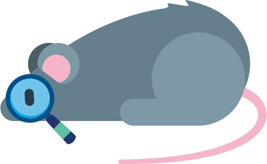
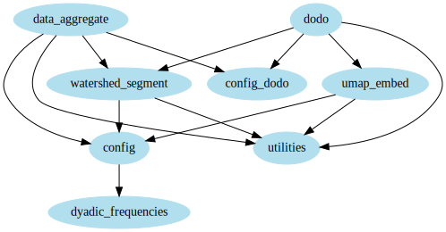

# animal-behavior-analysis

 

Neurobiology of Movement Lab, Medical Physics Department, Bariloche Atomic Centre, CNEA

## Showcase video

    

## Introduction

`animal-behavior-analysis` is a Python repository to produce animal behavior embeddings and behavior labels in an unsupervised way.
It uses the UMAP dimensionality reduction algorithm to create a low-dimensional behavior representation from a set of predefined features. The, it uses a watershed segmentation algorithm to identify clusters in the ethogram.

This repository was designed to be integrated after [`animal-behavior-preprocessing`](https://github.com/alvaro-concha/animal-behavior-preprocessing).
`animal-behavior-preprocessing` is the preparatory step, before using `animal-behavior-analysis`.
Both repositories are configured and optimized for analysing mouse behavior motion-tracking data, during the performance of accelerating rotarod tasks, recorded using both a frontal and a back camera, simultaneously.

`animal-behavior-analysis` is an implementation of a pipeline that runs several tasks.
To do this, we use [`doit`](https://pydoit.org/), a Python package that functions as a build-system tool, similar to [`make`](https://blogs.aalto.fi/marijn/2016/02/25/doit-a-python-alternative-to-make/), but with Python syntax!.
This build-system watches and keeps track of changes in files ("inputs and outputs", also known as "dependencies and targets", in build-system lingo) used by each task in the pipeline.
In this way, it makes it easier to keep files up-to-date, when tweaking different aspects of the pipeline (like modifying parameters, adding or removing tasks, etc.).
The build-system also figures out which tasks can be run in parallel, if a multi-core CPU is available.

Modules in `animal-behavior-analysis` and their import structure. An arrow from `module_a` to `module_b` indicates that `module_a` is importing `module_b`. The `dodo` module is the main module of the pipeline, and is named this way to conform with `doit` naming conventions. IPython Notebooks are not displayed in the graph.

## Instalation

In a terminal, run:

    git clone
    pip3 install -e git+http://github.com/alvaro-concha/animal-behavior-analysis.git#egg=AnimalBehaviorAnalysis

### Organization of the  project

The project has the following structure:

    animal-behavior-preprocessing/
      |- LICENSE.md
      |- logo.svg
      |- module_imports.svg
      |- README.md
      |- requirements.txt
      |- setup.py
      |- animal_behavior_analysis/
         |- bundle_edges.py
         |- config_dodo.py
         |- config.py
         |- data_aggregate.py
         |- dodo.py
         |- dyadic_frequencies.py
         |- figures_step_feature_selection.ipynb
         |- mutual_info.ipynb
         |- transitions.ipynb
         |- umap_embed.py
         |- umap_paso_pose.ipynb
         |- umap_video.ipynb
         |- umap_video.py
         |- umap_wavelet.ipynb
         |- utilities.py
         |- watershed_segment.py
         
